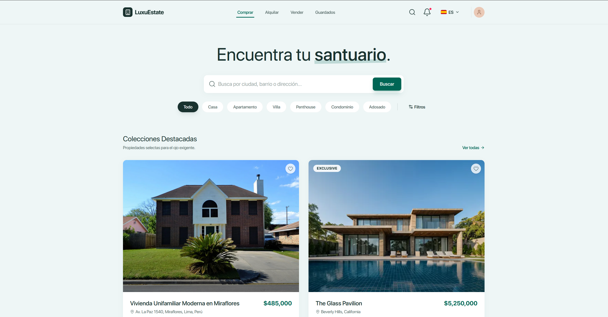
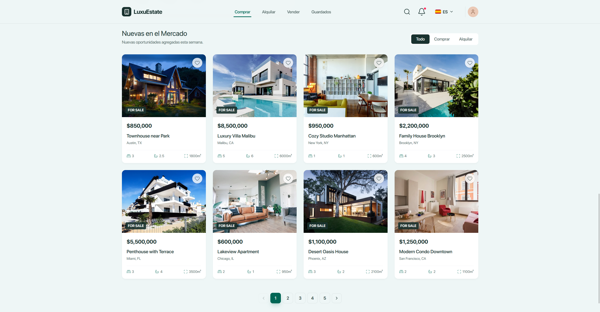
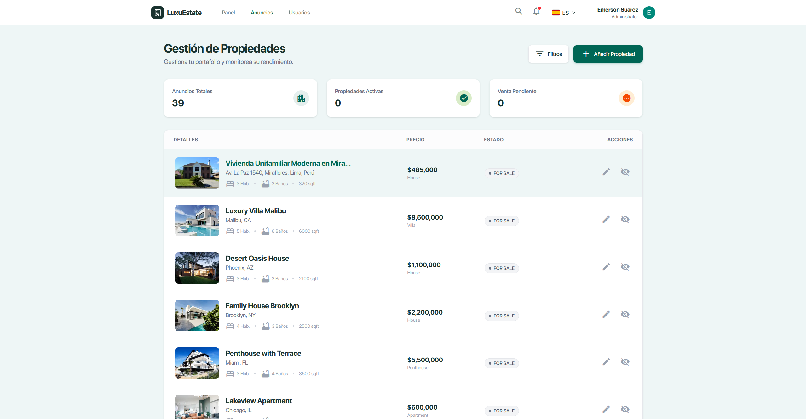

<div align="center">


# LuxuEstate

### Plataforma inmobiliaria premium — descubre, guarda y agenda visitas a propiedades de lujo.

[](https://nextjs.org/)
[](https://react.dev/)
[](https://www.typescriptlang.org/)
[](https://tailwindcss.com/)
[](https://supabase.com/)
[](https://luxu-estate-tau.vercel.app)

**[🔗 Ver Demo en Vivo](https://luxu-estate-tau.vercel.app)**

</div>

---

## 📖 Sobre el proyecto

**LuxuEstate** es una aplicación inmobiliaria full-stack, moderna y minimalista, construida con **Next.js 16 (App Router)** y **Supabase**. Combina una experiencia de cliente pulida —búsqueda avanzada, mapas interactivos, favoritos y multi-idioma— con un **panel de administración completo** para gestionar el catálogo de propiedades y los usuarios.

No es una maqueta estática: cada propiedad, imagen, usuario y favorito vive en una base de datos PostgreSQL real protegida con **Row Level Security**, con autenticación social, subida de imágenes a object storage y SEO listo para compartir en redes.

<div align="center">
  
  <p><em>Home: búsqueda con filtros, colecciones destacadas y nuevas en el mercado.</em></p>
</div>

---

## ✨ Funcionalidades

### 🌐 Experiencia pública

- **Home / Discover** con buscador, filtros rápidos, _Featured Collections_ y _New in Market_ con paginación.
- **Búsqueda y filtros avanzados** por texto, rango de precio, tipo, dormitorios, baños y amenidades.
- **Ficha de propiedad** con galería de imágenes, **mapa interactivo (Leaflet)**, descripción en _Markdown_, calculadora de pago estimado y agendado de visita.
- **Favoritos** persistentes por usuario, con ordenamiento (fecha / precio) y vista en **grid o lista**.
- **Perfil de usuario** con pestañas: propiedades guardadas, visitas y preferencias de cuenta.
- **Multi-idioma** 🇪🇸 🇬🇧 🇫🇷 (i18n con diccionarios y selector de idioma persistido por cookie).
- **Modo oscuro** y diseño totalmente **responsive**.

### 🔐 Autenticación

- Inicio de sesión **social** y gestión de sesión vía **Supabase Auth** (SSR con cookies seguras).
- **Roles** (`user` / `admin`) con protección de rutas en middleware.

### 🛠️ Panel de administración

- **Dashboard** con métricas (propiedades totales, activas, ventas pendientes).
- **Gestión de propiedades (CRUD)**: crear, editar, activar/desactivar y eliminar, con **subida de imágenes a Supabase Storage**.
- **Directorio de usuarios** con cambio de rol en tiempo real.
- Acceso restringido por rol mediante **Row Level Security** y middleware.

### 🚀 Ingeniería & SEO

- **SEO listo para compartir**: `metadataBase`, **Open Graph** (multi-imagen), **Twitter Cards** y **JSON-LD** (`RealEstateListing`).
- **Server Components** por defecto; _client components_ aislados solo donde hay interactividad.
- **ISR** (revalidación incremental) en fichas de propiedad.
- Tipado estricto end-to-end con **TypeScript**.

> 📸 Las capturas inferiores muestran solo una parte de la app. La ficha de propiedad, los favoritos, el perfil, el login social y la búsqueda avanzada se exploran mejor en la **[demo en vivo](https://luxu-estate-tau.vercel.app)**.

<div align="center">
  
  <p><em>Catálogo de propiedades con tarjetas, estado y specs.</em></p>
  
  <p><em>Panel de administración: gestión completa del portafolio.</em></p>
</div>

---

## 🧰 Stack tecnológico

| Categoría      | Tecnología                                                  |
| -------------- | ----------------------------------------------------------- |
| **Framework**  | Next.js 16 (App Router, Server Components)                  |
| **UI**         | React 19 · Tailwind CSS v4 · lucide-react                   |
| **Lenguaje**   | TypeScript 5                                                |
| **Backend**    | Supabase — PostgreSQL · Auth · Storage · Row Level Security |
| **Mapas**      | Leaflet · react-leaflet                                     |
| **Contenido**  | react-markdown                                              |
| **i18n**       | Diccionarios propios (es · en · fr) con cookie de locale    |
| **Tipografía** | SF Pro Display (local, `next/font`)                         |
| **Despliegue** | Vercel                                                      |

---

## 🏗️ Arquitectura

Organización **feature-based + colocation** para escalar con orden:

```
luxu-estate/
├── app/                      # App Router
│   ├── page.tsx              # Home / Discover
│   ├── layout.tsx            # Layout raíz (fuente, navbar, i18n, SEO)
│   ├── properties/[slug]/    # Ficha de propiedad (+ _components colocados)
│   ├── favorites/            # Favoritos del usuario
│   ├── profile/              # Perfil con pestañas
│   ├── login/                # Login social
│   ├── auth/callback/        # Callback OAuth
│   └── admin/                # Panel de administración (dashboard, CRUD, usuarios)
├── components/
│   ├── ui/                   # Átomos agnósticos (Map, Pagination, Markdown…)
│   ├── layout/               # Navbar, selector de idioma, menú admin
│   ├── properties/           # Tarjetas y botón de guardado
│   ├── search/               # Buscador y modal de filtros
│   └── providers/            # Contextos (i18n, propiedades guardadas)
├── lib/
│   ├── supabase/             # Clientes (browser/server) + sesión
│   ├── i18n/                 # Config y diccionarios
│   ├── types.ts              # Modelos de dominio + mapeo DB↔UI
│   └── site.ts               # URL canónica para SEO
├── supabase/migrations/      # Esquema versionado (tablas, RLS, buckets)
└── docs/                     # Diseño de referencia y capturas
```

---

## 🚀 Empezar

### Requisitos

- **Node.js 18+**
- Una cuenta de **[Supabase](https://supabase.com/)** (gratuita)

### 1. Clonar e instalar

```bash
git clone https://github.com/<tu-usuario>/luxu-estate.git
cd luxu-estate
npm install
```

### 2. Variables de entorno

Copia la plantilla y completa tus credenciales:

```bash
cp .env.template .env.local
```

```env
NEXT_PUBLIC_SUPABASE_URL=https://tu-proyecto.supabase.co
NEXT_PUBLIC_SUPABASE_ANON_KEY=tu_anon_key
# URL canónica de producción (sin / final). Importante para el SEO / Open Graph.
NEXT_PUBLIC_SITE_URL=http://localhost:3000
```

### 3. Base de datos

Aplica las migraciones de `supabase/migrations/` con la **[Supabase CLI](https://supabase.com/docs/guides/local-development)**:

```bash
supabase link --project-ref <tu-ref>
supabase db push
```

Esto crea las tablas (`properties`, `saved_properties`, `user_profiles`), las **políticas RLS** y el **bucket de imágenes**.

### 4. Ejecutar

```bash
npm run dev
```

Abre **[http://localhost:3000](http://localhost:3000)** 🎉

---

## 📜 Scripts

| Comando         | Descripción            |
| --------------- | ---------------------- |
| `npm run dev`   | Servidor de desarrollo |
| `npm run build` | Build de producción    |
| `npm run start` | Servir el build        |
| `npm run lint`  | Linter (ESLint)        |

---

## ☁️ Despliegue

Optimizado para **Vercel**:

1. Importa el repositorio en Vercel.
2. Configura las variables de entorno (incluida `NEXT_PUBLIC_SITE_URL` con tu dominio real).
3. Deploy automático en cada push. ✅

> 💡 Tras desplegar, valida los previews sociales en el [Sharing Debugger de Facebook](https://developers.facebook.com/tools/debug/) y el [Post Inspector de LinkedIn](https://www.linkedin.com/post-inspector/).

---

## 🗺️ Roadmap

- [ ] Persistir visitas agendadas en base de datos.
- [ ] Notificaciones de nuevas propiedades.
- [ ] Generación dinámica de imágenes OG por propiedad.
- [ ] `sitemap.xml` y `robots.txt` automáticos.
- [ ] Tests E2E (Playwright).

---

## 👤 Autor

**Emerson Suarez**

Proyecto desarrollado como parte de la formación en **DevTalles**.

---

<div align="center">
  <sub>Construido con ❤️ usando Next.js, Supabase y Tailwind CSS.</sub>
</div>
